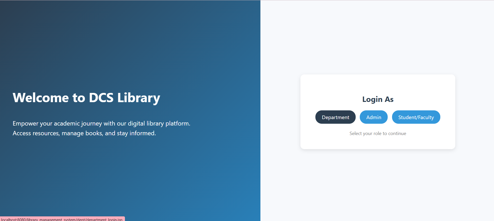
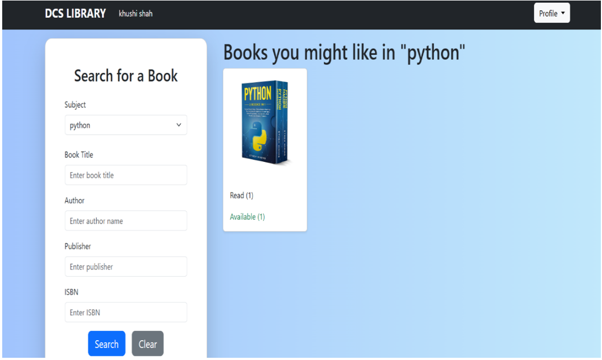
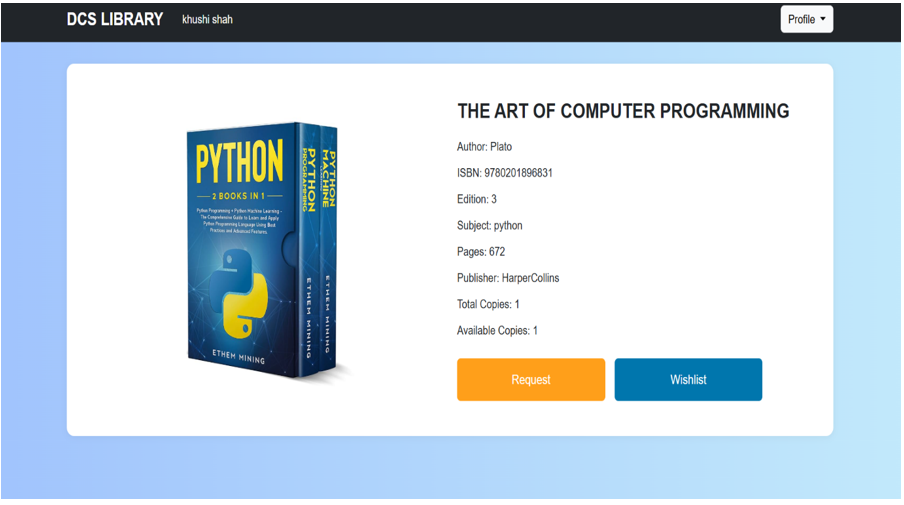
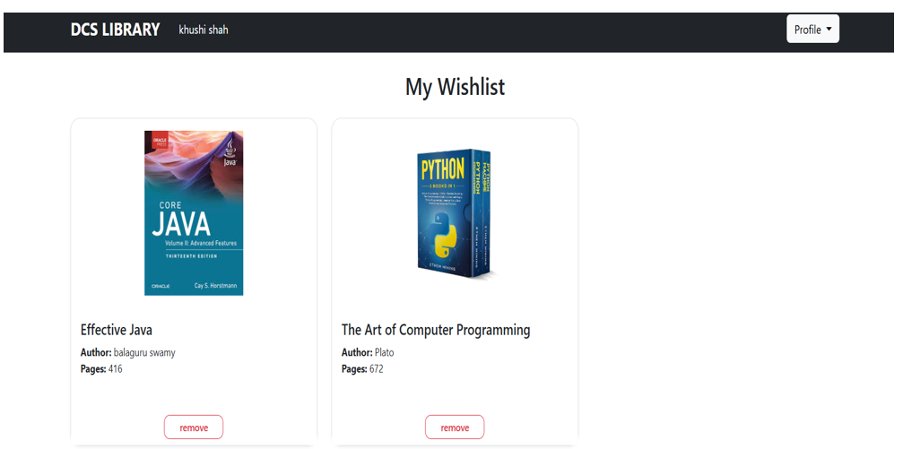
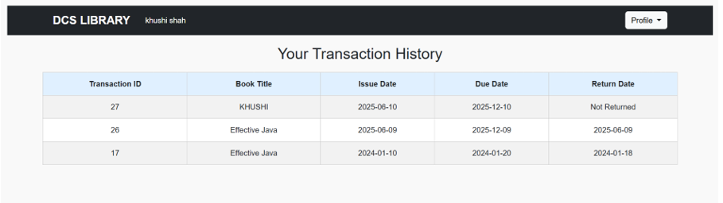

# Project Title: DCS Library Management System
   
# Description:
The DCS Library Management System is a web-based application built to facilitate the librarian for daily library operations such as book inventory, user management, book issue/return, transaction          tracking,and report generation for the Department of Computer Science Rollwala , Gujarat University. it is built based the requirement of our department (Department of Computer Science Rollwala) . It replaces the manual record system with an efficient, secure, and mobile-accessible platform. Features include Book issue , OTP verification, email notifications, role-based access, grievance management ,and PDF report exports.

# Key Features:
 - User Management (admin, librarian, student)
 - Book Management (add/update/view)
 - Report Management (view and Download the Reports)
 - Online Book Requests (with approval logic)
 - OTP-Based Book Issue/Return Verification
 - Email Notifications for due/overdue books
 - PDF Report Generation
 - grievance Management
 - Advanced Search (by title, author, ISBN, etc.)
 - Transaction & Deadline Tracking

# Technologies Used:
  
-  Frontend: HTML, CSS, JavaScript, Bootstrap, JSP
-  Backend: Java (Servlets, JSP), JDBC
-  Database: MySQL
-  Server: Apache Tomcat
-  IDE: NetBeans
-  Version Control: Git

# How to Run:
   Clone the repo:
- git clone : https://github.com/AasimaMansuri749/DCS_Library_management_system-.git.
- Import into NetBeans or your preferred IDE.
  
- Configure MySQL:
Create a database library_management_system.
   - Import the provided SQL.
   - Edit DB credentials in your Java classes (if needed).

- Deploy project on Apache Tomcat.
- Access: localhost:8080
  #  Screenshots

---

##  Admin (User) Screens

###  Dashboard

###  Transaction Management

###  User Management

###  Book Management

###  Subject Management

###  Reports Management

##  Student/Faculty Screens

