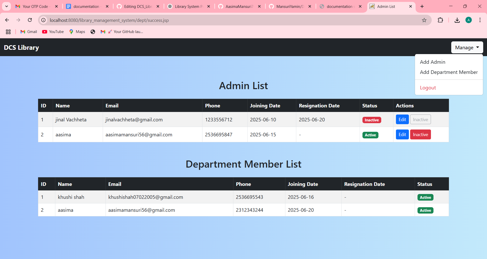

#  Project Title: DCS Library Management System

##  Description
The **DCS Library Management System** is a web-based application designed to streamline library operations for the **Department of Computer Science, Rollwala, Gujarat University**. This system replaces the manual record-keeping process with an efficient, secure, and mobile-accessible platform. It includes functionalities like book inventory, user management, transaction tracking, OTP-based book issue/return, grievance handling, and report generation.

---

##  Key Features

- User Role Management (Admin, Librarian, Student)
- Book Management (Add, Update, View)
- Report Management (View & PDF Download)
- Online Book Requesting with Approval Logic
- OTP-Based Book Issue/Return Verification
- Email Notifications (Due/Overdue alerts)
- Grievance Management System
- Advanced Search (Title, Author, ISBN, etc.)
- Transaction & Deadline Tracking

---

##  Technologies Used

- **Frontend**: HTML, CSS, JavaScript, Bootstrap, JSP  
- **Backend**: Java (Servlets, JSP), JDBC  
- **Database**: MySQL  
- **Server**: Apache Tomcat  
- **IDE**: NetBeans  
- **Version Control**: Git  

---

##  How to Run

1. Clone the repository:
   ```bash
   git clone https://github.com/AasimaMansuri749/DCS_Library_management_system-.git
2. Import the project into NetBeans or your preferred Java IDE.

3. Configure MySQL:

  - Create a database named library_management_system.
   
  - Import the provided SQL file (library_management_system.sql).
   
  - Update DB credentials in your Java files (usually in the DAO or DB utility class).

4. Deploy the project on Apache Tomcat Server.

Run the server and open in browser:
http://localhost:8080/DCS_Library_management_system
#  Screenshots
## Admin / Librarian Screens
<table> <tr> <td>
   <br>Home Page</td> <td>
   <br>Admin Dashboard</td> </tr> <tr> <td>
   <br>Transaction Management</td> <td>
   <br>User Management</td> </tr> <tr> <td>
   <br>Book Management</td> <td>
   <br>Subject Management</td> </tr> <tr> <td>
   <br>Report Management</td> <td>
   <br>Department Dashboard</td> </tr>
</table>

## Student/Faculty Screens
<table> <tr> <td>
<br>Search Page</td> <td>
<br>Book List</td> </tr> <tr> <td>
<br>Book Details</td> <td>
<br>Wishlist</td> </tr> </table>
